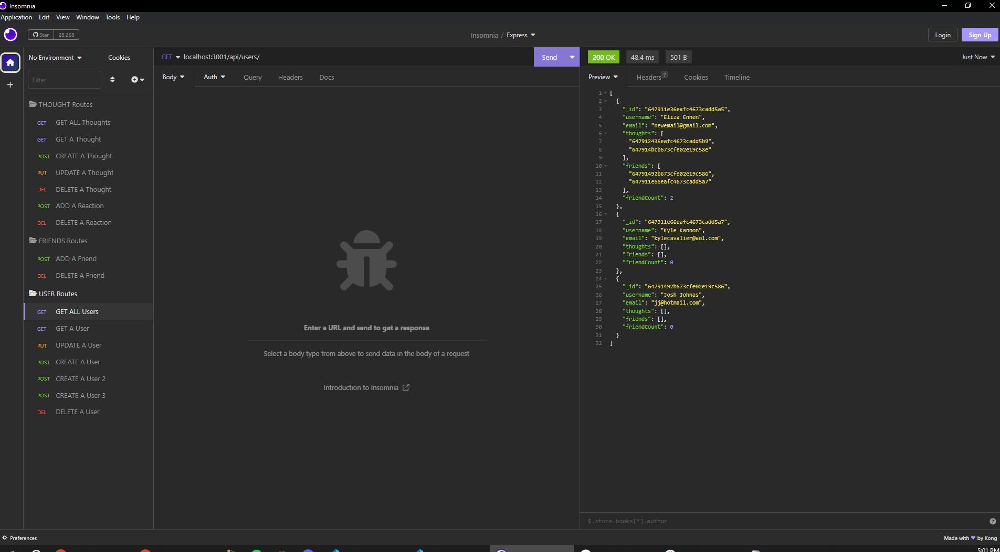
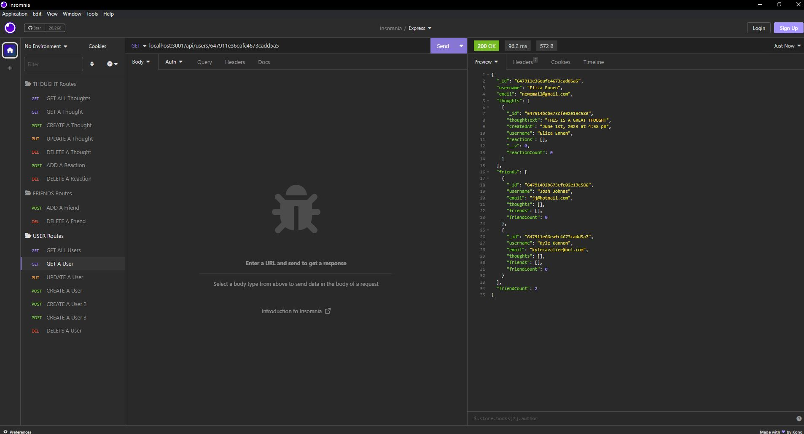
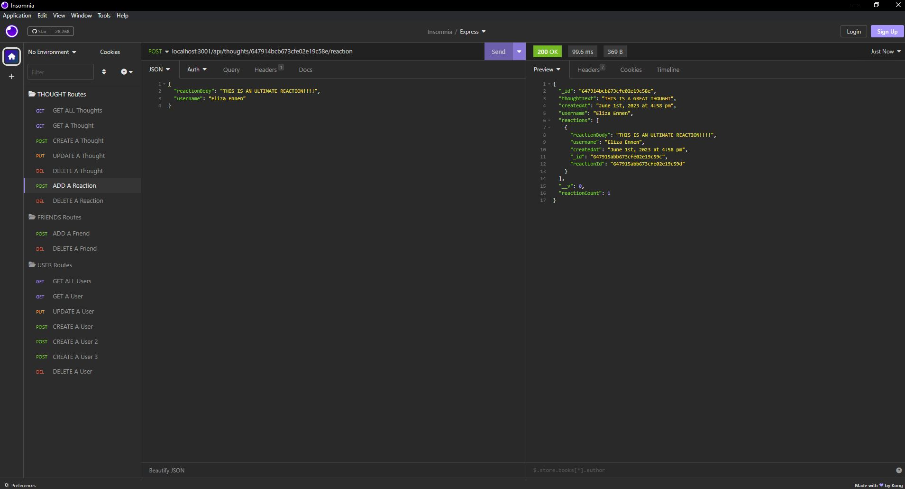
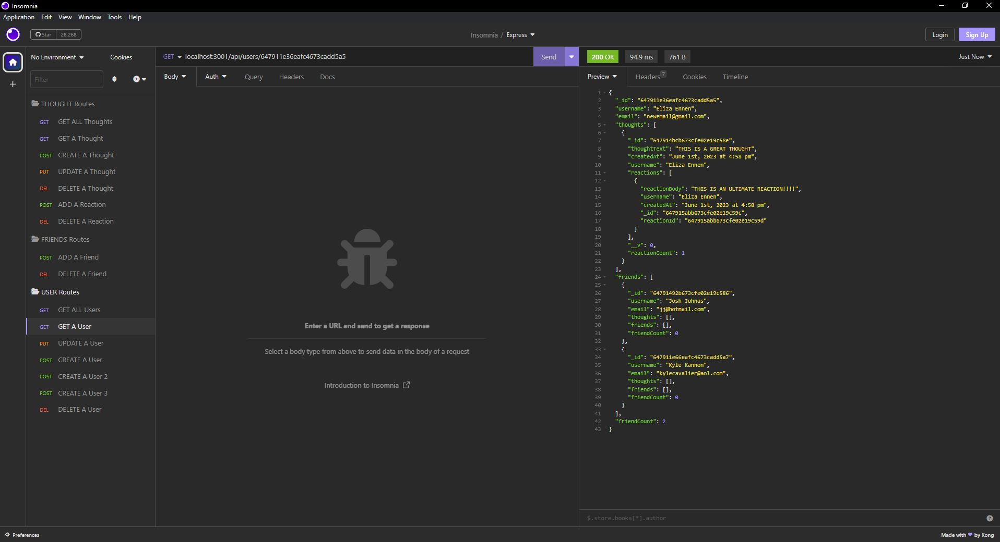

#                             FriendsNetworkApi!
 

##  Table of Contents  

1. [Description](#desc)
2. [Installation](#install)
3. [Usage](#usage)
4. [License](#license) 
5. [Contributions](#contributions)
6. [Testing](#testing)
7. [Questions](#questions) 

## 1. Descrption

This application demos the intergration of Express.js for routing, a MongoDB database, and the Mongoose ODM. Additonally used the npm nodepack Moment for date formatting. 

 

## Insallation
No installation required. 

## 3. Usage Information

N/a

## License   

 

## Contributions 

N/a

## Tests
Watch the demo here!
Screencastify:
https://drive.google.com/file/d/1g-aidqEs8xgF_XWaPaDnQlxcp39IK85E/view

## Questions 

Feel free to browse my github profile here @ https://github.com/rxs291
If you have any questions, reach me at my email here, rxs291@yahoo.com.

